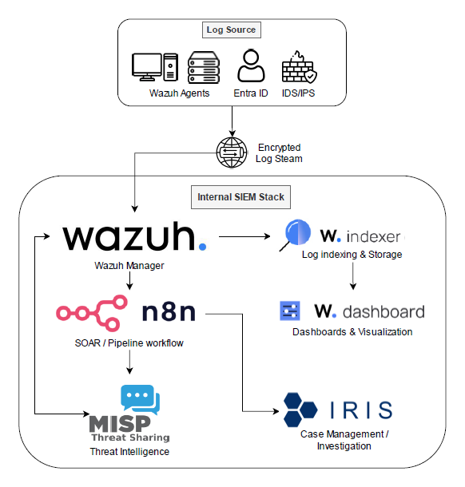

<h1 align="center"> The Bridge Between</h1>

## The Vision🎯

There are enterprise companies running full-scale SOCs with tools costing more than a deposit on a house. Then on the other side, you've got small to medium sized businesses thinking "we've got antivirus running, so we should be fine...right?"

Somewhere in between those two worlds is a massive gap, and this project exists to show you that you can fill it. The Bridge Between is exactly what it sounds like - a way to get from "no real security" to "actually decent security" without needing a ridiculous budget.

 **So What is it then?**

This project is a **Security Operations Centre (SOC)** built entirely using free and open-source tools. It’s not just a collection of tools thrown together and left to suffer — it’s a **working security pipeline**.

Logs are collected, suspicious activity is detected, alerts are enriched with threat intelligence, and incidents are created and tracked properly. Instead of alerts sitting in a dashboard waiting to be ignored, they actually go somewhere and trigger action.

In simple terms for the muggles:

> It takes you from **“something might be wrong”**  
> to **“here’s what’s wrong, why it matters, and what to do next.”**

The purpose of this is to show that:
- You can build a **functional, realistic SOC environment**
- You can automate large parts of the investigation process
- You can respond to threats in a structured way  
- You can do all of that **whilst still having money left to actually spend**

It’s not pretending to replace high-end platforms.

> It’s proving you don’t need them to get started.

## So? How Much 💸💸 Can I Save?

I've once saw a quote from an MSSP that offered a "SIEM (Security Infomation and Event Management) Solution" - which was basically a bundle of outdated, vulnerable open-source tools that was lightly stitched together. No innovation, no real engineering, just straight up "That will be £15,000 a month please."

| Solution Type             | Cost (Approx)      | What You Get                          |
| ------------------------- | ------------------ | ------------------------------------- |
| MSSP “SIEM”               | £10k–£20k/month    | Repackaged tooling + support          |
| Enterprise Security Stack | £20k–£100k+/year   | Full ecosystem (if you can afford it) |
| **The Bridge Between**    | **£0 (licensing)** | **Fully functional SOC-style stack**      |

Everything here runs entirely on free tooling, and no, not the typicall "free tier but actually kinda useless" free tooling. The only real cost is the infrastructure and your time.

## The Stack

Instead of one expensive “do everything” platform, this project uses specialised tools that actually do their job well.

| Tool          | Role                                     |
| ------------- | ---------------------------------------- |
| **Wazuh**     | SIEM, XDR, vulnerability detection       |
| **DFIR IRIS** | Incident response & case management      |
| **n8n**       | SOAR                                     |
| **MISP**      | Threat intelligence platform             |
| **pfSense**   | Firewall, network control & segmentation |

## Architecture Overview

<table>
  <tr>
    <td>
      
    </td>
    <td>

**Flow Explained**

| Stage | Purpose |
|------|--------|
| Wazuh Agent | Generates logs and events |
| Wazuh | Collects logs, detects and alerts suspicious activity |
| n8n | Automates enrichment and response workflows |
| MISP | Adds context if malicious (is this IP actually bad?) |
| DFIR IRIS | Case management |

  </tr>
</table>

## Future Implementation

This project is continuously evolving. Planned improvements include:

| Area            | Improvement                                     |
| --------------- | ----------------------------------------------- |
|  Monitoring   | Grafana & Prometheus for infrastructure metrics |
|  Compliance  | CIS Benchmark checks via Wazuh SCA              |
|  Metrics      | MTTD / MTTR tracking dashboards                 |
|  Response     | Automated endpoint isolation                    |
|  Threat Intel | Automated IOC ingestion into MISP               |
|  Correlation  | Improved multi-source alert correlation         |
|  Automation    | Deeper Wazuh active response integrations       |
