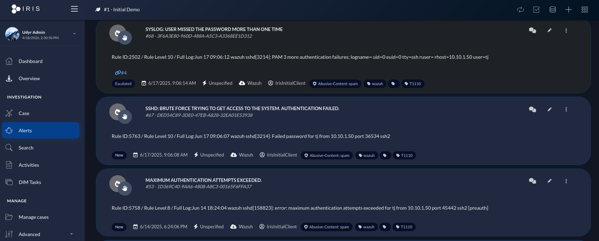

# DFIR IRIS

<p align="center">
  
</p>

## Overview

DFIR IRIS is used as the **case management and incident response platform** within this SOC. It acts as the central location for tracking, investigating, and managing security incidents generated from alerts.

Within this project, IRIS ensures that all security events are properly documented, investigated, and resolved in a structured and repeatable way.

<p align="center">
  
</p>

---

## Key Responsibilities

* Incident creation and tracking
* Case management and organisation
* Investigation workflow support
* Evidence and artefact collection
* Documentation of response actions

---

## Architecture Role

DFIR IRIS sits at the **end of the detection and enrichment pipeline**, where alerts become structured incidents:

```
     Wazuh SIEM
 (Detection & Alerts)
        │
        ▼
        n8n
 (Enrichment & Automation)
        │
        ▼
    DFIR IRIS
 (Case Management)
```

---

## Infrastructure

DFIR IRIS runs on a dedicated **VMware Workstation VM** as a **Docker container**, accessed via its web interface for case management and analyst workflows.

---

## Incident Creation

Incidents are automatically created in IRIS via **n8n workflows**. When an alert meets the severity threshold, n8n calls the IRIS API to open a new case without any manual intervention required.

### Data Included at Creation:

* Alert details from Wazuh (rule ID, level, description)
* Enriched threat intelligence (VirusTotal, AbuseIPDB, MISP results)
* Indicators of Compromise (IP addresses, domains, file hashes)
* Event timeline and raw log metadata

This ensures analysts have full context from the moment a case is opened.

---

## Case Structure

Each incident in IRIS follows a consistent structure to support efficient investigation:

| Field | Description |
|-------|-------------|
| **Title** | Summary of the incident (e.g. "Malicious Login – [hostname]") |
| **Description** | Alert context, enrichment output, and initial findings |
| **Severity** | Assigned based on Wazuh rule level and enrichment verdict |
| **IOCs** | IP addresses, domains, and file hashes linked to the incident |
| **Tasks** | Structured investigation and response steps |
| **Comments** | Analyst notes, findings, and escalation decisions |
| **Assets** | Affected hosts, accounts, and systems |

---

## Investigation Workflow

IRIS supports a structured investigation process aligned with standard incident response phases:

### 1. Triage

* Review alert context and enrichment data
* Confirm whether the alert is a true positive or false positive
* Assign severity and priority

### 2. Analysis

* Examine associated logs and enriched indicators
* Correlate with threat intelligence from MISP
* Identify scope: how many systems or accounts are affected?
* Map to MITRE ATT&CK technique where applicable

### 3. Containment

* Verify that automated responses (IP block, account disable) have executed correctly
* Execute any additional manual containment steps required
* Prevent lateral movement or further malicious activity

### 4. Eradication & Recovery

* Remove threats and restore affected systems to a known good state
* Confirm the environment is secure before marking the incident as contained

### 5. Closure

* Document all findings, actions taken, and the full timeline
* Mark the incident as resolved
* Add any newly identified indicators to MISP for future detection use

---

## Integration with SOC Workflow

DFIR IRIS integrates with all other tools in the environment:

* **n8n** → automatically creates and updates cases via the IRIS API
* **Wazuh** → provides the original alert data and log context
* **MISP** → supplies threat intelligence for investigation correlation
* **OPNsense / Microsoft Entra** → response actions executed by automation are documented within the case

This ensures a seamless and fully auditable transition from detection to resolution.

---

## Key Benefits

* Centralised incident tracking across all security events
* Structured and repeatable investigation process
* Full visibility into all actions taken and analyst findings
* Supports collaboration between multiple analysts
* Aligns with real-world SOC workflows and IR methodologies

---

## Limitations

* Requires n8n integration for automated case creation
* Complex investigations still require manual analyst effort and judgement
* New users require familiarisation with the IRIS UI and workflow model

---

## Design Approach

The use of DFIR IRIS in this project follows key principles:

* **Automation-driven intake** – cases created automatically from enriched alerts, not manual entry
* **Structured investigations** – consistent handling ensures no steps are missed
* **Full auditability** – all actions, decisions, and findings are documented and retained
* **Scalable** – capable of supporting multiple clients or environments from a single instance

---

## Summary

DFIR IRIS provides the **incident management backbone** of the SOC. It ensures that every alert that reaches case status is investigated in a consistent, structured, and auditable manner — from initial triage through to closure and lessons learned.

---
